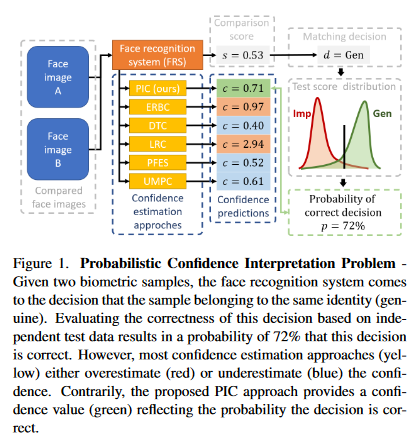
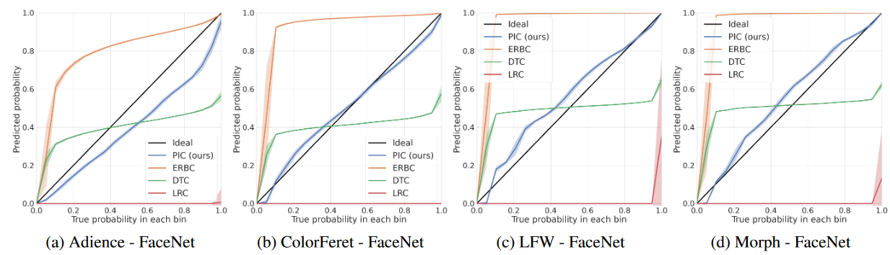
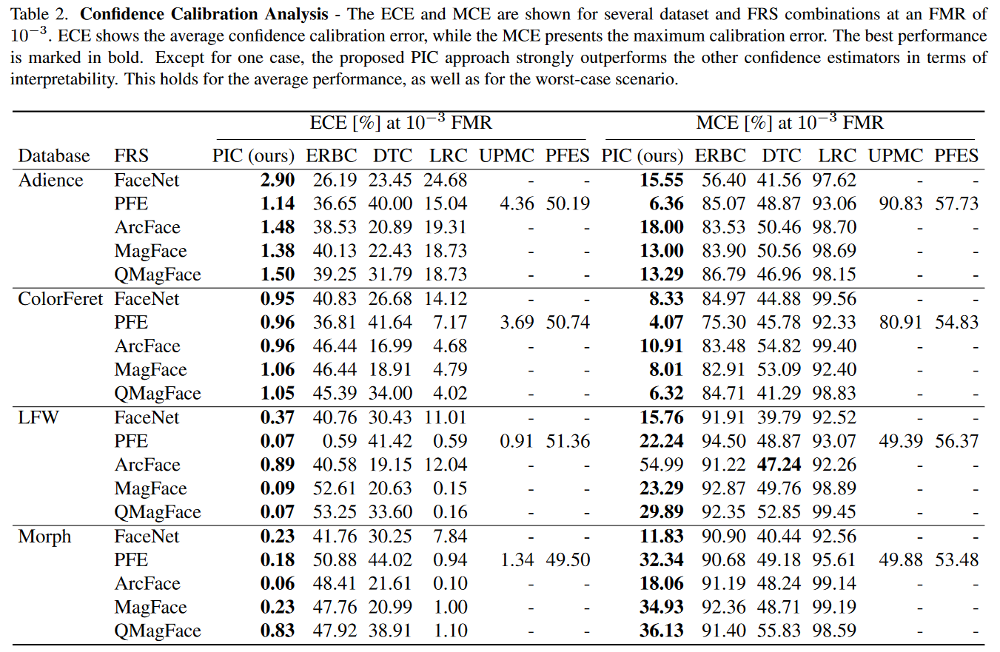
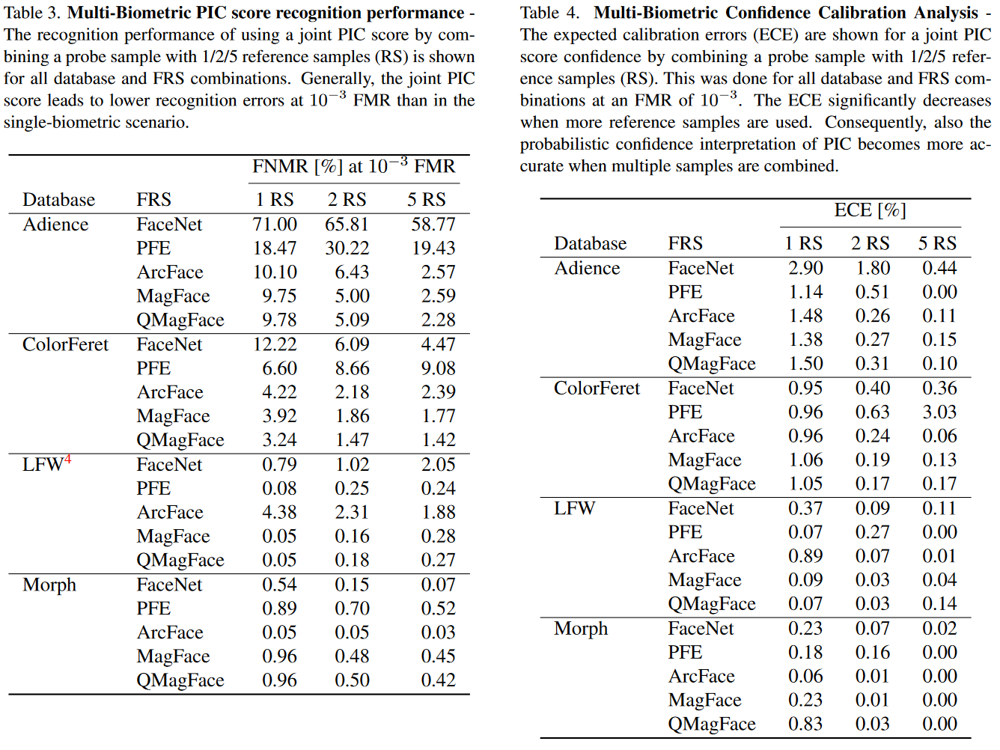

# Optimal Matching Confidence for Biometric Systems

[](https://paperswithcode.com/sota/face-recognition-on-adience?p=pic-score-probabilistic-interpretable)  [](https://paperswithcode.com/sota/face-recognition-on-color-feret?p=pic-score-probabilistic-interpretable)
[](https://paperswithcode.com/sota/face-recognition-on-morph?p=pic-score-probabilistic-interpretable)
[](https://paperswithcode.com/sota/face-recognition-on-lfw?p=pic-score-probabilistic-interpretable)

## PIC-Score: Probabilistic Interpretable Comparison Score for Optimal Matching Confidence in Single- and Multi-Biometric (Face) Recognition

 

* [Research Paper](https://arxiv.org/abs/2211.12483)


## Table of Contents 

- [Abstract](#abstract)
- [Key Points](#key-points)
- [Results](#results)
- [Installation](#installation)
- [Citing](#citing)


## Abstract

In the context of biometrics, matching confidence refers to the confidence that a given matching decision is correct.
Since many biometric systems operate in critical decision-making processes, such as in forensics investigations, accurately and reliably stating the matching confidence becomes of high importance.
Previous works on biometric confidence estimation can well differentiate between high and low confidence, but lack interpretability.
Therefore, they do not provide accurate probabilistic estimates of the correctness of a decision.
In this work, we propose a probabilistic interpretable comparison (PIC) score that accurately reflects the probability that the score originates from samples of the same identity.
We prove that the proposed approach provides optimal matching confidence. 
Contrary to other approaches, it can also optimally combine multiple samples in a joint PIC score which further increases the recognition and confidence estimation performance.
In the experiments, the proposed PIC approach is compared against all biometric confidence estimation methods available on four publicly available databases and five state-of-the-art face recognition systems.
The results demonstrate that PIC has a significantly more accurate probabilistic interpretation than similar approaches and is highly effective for multi-biometric recognition.

## Key Points

In contrast to previous works, the proposed PIC score unifies several beneficial properties:

- **Interpretability**: The PIC score accurately reflects the probability that the comparison belongs to a genuine (same person) comparison. This allows critical decision-making processes to act upon reliable decisions or, in case of low confidence, allow to ask a more confident system or human operator for the decision.
- **Optimality**: Despite its simplicity, PIC is derived from Bayes' theorem and thus, provides optimal matching confidences given suitable training data. This might be useful, e.g. in law enforcement, when approaches with a theoretical foundation are preferred.
- **Universality**: Since PIC operates on score level, it is not limited to face and can be applied to any biometric modality and recognition model without changing its single-biometric performance. 
- **Combinability**: Contrarily to standard comparison scores, a joint PIC score can naturally be computed when multiple sample samples are given. This leads to stronger multi-biometric recognition performance without losing its interpretability and is highly beneficial when e.g. dealing with multiple video frames.
- **Integratability**: PIC is easily integrateable. It can be easily added on top of an existing biometric system without retraining that system. Moreover, it avoids the need for data- and computationally-expensive experiments to determine the wanted decision threshold due to its interpretable nature.


## Results

**Confidence Calibration Curves (CCC)** - The CCC for FaceNet on all datasets are shown. While most approaches have to deal with high under-
and over-confident predictions, the proposed PIC produces close-to-ideal (black line) probabilistic confidence estimates in most cases.



**Confidence Calibration Analysis** - The Expected Calibration Error (ECE) and Maximum Calibration Error (MCE) are shown for several dataset and FRS combinations at an FMR of 10^−3. ECE shows the average confidence calibration error, while the MCE presents the maximum calibration error. The best performance is marked in bold. Except for one case, the proposed PIC approach strongly outperforms the other confidence estimators in terms of
interpretability. This holds for the average performance, as well as for the worst-case scenario.



**Multi-Biometric PIC score recognition performance** - The recognition performance of using a joint PIC score by combining a probe sample with 1/2/5 reference samples (RS) is shown for all database and FRS combinations. Generally, the joint PIC score leads to lower recognition errors at 10^−3 FMR than in the single-biometric scenario.

**Multi-Biometric Confidence Calibration Analysis** - The expected calibration errors (ECE) are shown for a joint PIC score confidence by combining a probe sample with 1/2/5 reference samples (RS). This was done for all database and FRS combinations at an FMR of 10−3. The ECE significantly decreases when more reference samples are used. Consequently, also the probabilistic confidence interpretation of PIC becomes more accurate when multiple samples are combined.



## Installation

For the code in this repository to work, the following packages are required: 

- Python 3
- Numpy
- Scipy

Given that you have embeddings and a FRS, you can simply add this to your workflow with this minimal installation process. 


#### CPU Parallel accelaration

We leverage several cores of the CPU to reduce computation time. You can modify the percentage of available CPU cores to use by changing the following expression: 

    thread_count=int(.8 * mp.cpu_count()))
    
, where .8 is the current ratio of (cores to use)/(cores available).


## Citing

If you use this code, please cite the following paper.

```
@misc{https://doi.org/10.48550/arxiv.2211.12483,
  doi = {10.48550/ARXIV.2211.12483},
  url = {https://arxiv.org/abs/2211.12483},
  author = {Neto, Pedro C. and Sequeira, Ana F. and Cardoso, Jaime S. and Terh{\"{o}}rst, Philipp},
  keywords = {Computer Vision and Pattern Recognition (cs.CV), FOS: Computer and information sciences, FOS: Computer and information sciences},
  title = {PIC-Score: Probabilistic Interpretable Comparison Score for Optimal Matching Confidence in Single- and Multi-Biometric (Face) Recognition},
  publisher = {arXiv},
  year = {2022},
  copyright = {arXiv.org perpetual, non-exclusive license}
}

```


